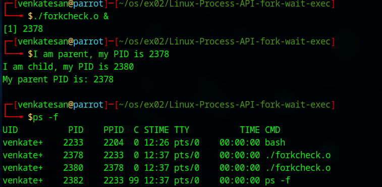

# Linux-Process-API-fork-wait-exec-
Ex02-Linux Process API-fork(), wait(), exec()
# Ex02-OS-Linux-Process API - fork(), wait(), exec()
Operating systems Lab exercise


# AIM:
To write C Program that uses Linux Process API - fork(), wait(), exec()

# DESIGN STEPS:

### Step 1:

Navigate to any Linux environment installed on the system or installed inside a virtual environment like virtual box/vmware or online linux JSLinux (https://bellard.org/jslinux/vm.html?url=alpine-x86.cfg&mem=192) or docker.

### Step 2:

Write the C Program using Linux Process API - fork(), wait(), exec()

### Step 3:

Test the C Program for the desired output. 

# PROGRAM:

## C Program to print process ID and parent Process ID using Linux API system calls

```c
//C Program to create new process using Linux API system calls fork() and exit()
#include <stdio.h>
#include <stdlib.h>
#include <unistd.h>

int main() {
    int pid = fork();

    if (pid == 0) { 
        printf("I am child, my PID is %d\n", getpid()); 
        printf("My parent PID is: %d\n", getppid()); 
        sleep(2);  // Keep child alive for verification
    } else { 
        printf("I am parent, my PID is %d\n", getpid()); 
        wait(NULL); 
    }
}

```
##OUTPUT




## C Program to create new process using Linux API system calls fork() and exit()


##OUTPUT


## C Program to execute Linux system commands using Linux API system calls exec() family


##OUTPUT


# RESULT:
The programs are executed successfully.
